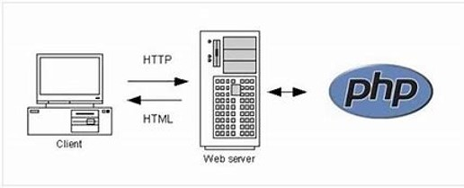

## Accessing by phone

<center>


</center>

## Keyword (*)

Keywords using in this presentation:

- JUnit: is a regression unit testing framework for Java programming languages
- unit test: is a testing method where the smallest testable parts of a software are tested
- xUnit: xUnit.net is a free, open source, community-focused unit testing tool for the .NET Framework (1)
- PHP: a server side scripting languages
- Eclipse IDE: Integrated development environment for Java development
- test case: is a document, which has a set of test data, preconditions, expected results and post-conditions, developed for a particular test scenario in order to verify compliance against a specific requirement (1)
- Test suite: grouping test cases into a test script that can run every test for the application (1)
- Test Driven Development (TDD): test cases for each functionality are created and tested first and if the test fails then the new code is written in order to pass the test and making code simple and bug-free (1)

## Introduction to SimpleTest

- SimpleTest is a regression testing framework that built around test cases
- Test PHP only (not Python, not anything else)
- Completed PHP developer test solution ( unit test, automation test, GUI test, mock object, TDD (*)...)

<center>


</center>

## SimpleTest Pre-requirement

- Understand of testing methods(in this case Unit Testing)
- Understand of PHP web development language
- Know how to program (design for developer and tester)

<center>


</center>


## SimpleTest Features

- Completed PHP developer test solution
- Easy to use and extend
- Test cases are displayed without a web browser, and auto-loading 
- Supports simplest HTML display
- xUnit (*) style test cases
- Support mock objects, automation testing, fill-in form, authentication, web tester(*)
- _**Retrieved from (1)**_

## Download SimpleTest for PHP

- Download from SourceForge.net
- Download as a plugin  for [Eclipse IDE (*) ](https://sourceforge.net/projects/simpletest/files/eclipse%20plugin/) also from SourceForge.net
- _**Retrieved from (1)**_

<center>


</center>

## How to Use SimpleTest for PHP

- Use as PHP script, develop along with the source code
- Use Simple Test to develop test case, test suite (*)
- _**Retrieved from (1)**_

<center>


</center>

## What is PHP

- PHP is an acronym for "PHP: Hypertext Pre-processor"
- PHP is a widely-used, open source scripting language
- PHP scripts are executed on the server
- PHP is free to download and use
- _**Retrieved from (5)**_

## What is PHP files

- PHP files can contain text, HTML, CSS, JavaScript, and PHP code
- PHP code is executed on the server, and the result is returned to the browser as plain HTML
- PHP files have extension ".php"
- _**Retrieved from (5)**_

## What is Unit Testing
- Unit Testing is the first level of software testing where the smallest testable parts of a software are tested. 
- Unit Testing is used to validate that each unit of the software performs as designed. 
- Unit Testing is usually performed by developer.
- Tester should test both the functionality of a unit and the mock object version of the testing unit (use case below).

## Testing Client and Server Side

- Client Side: SimpleTest allows testing code to execute on the client-side such as a web browser which is focusing on PHP tasks (e.g. logging into a site)
- Server side: Server-side behavior can be tested by writing simple unit test cases to test functionality and behavior of a single component (7)




## Popular SimpleTest package and classes
- Most use package:
  - 'simpletest/autorun.php': include for all kind of simple test
  - 'simpletest/web_tester.php': include for web testers (GUI testing)
  - 'simpletest/mock_objects.php': generate mock object
  
- Most use class/interface:
  - TestSuite class: generate test suites (Group test)
  - UnitTestCase class: generate unit test case(s)
  - Mock class: generate mock object

## UnitTestCases class
- The UnitTestCases class belong to the 'simpletest/autorun.php'
- To implement SimpleTest framework (for unit testing), testers need to extend the UnitTestCase class of SimpleTest framework. 
- This class includes standard tests for equality, references and pattern matching


## UnitTestCase Class
Most used functions of the 'UnitTestCase' class:
```php
assertTrue($x)	                // Fail if $x is false
assertFalse($x)                 // Fail if $x is true
assertNull($x)                  // Fail if $x is set
assertNotNull($x)               // Fail if $x not set
assertIsA($x, $t)               // Fail if $x is not the class or type $t
assertNotA($x, $t)	            // Fail if $x is of the class or type $t
assertEqual($x, $y)	            // Fail if $x == $y is false
assertNotEqual($x, $y)	        // Fail if $x == $y is true
assertWithinMargin($x, $y, $m)  // Fail if abs($x - $y) < $m is false
assertOutsideMargin($x, $y, $m)	// Fail if abs($x - $y) < $m is true
// see more at http://simpletest.sourceforge.net/en/unit_test_documentation.html

```

## Convenience Methods (UnitTestCase Class)
- The 'UnitTestCase' class also have some convenience methods for debugging code or extending the test suite...
```php
setUp()	                // Runs this before each test method
tearDown()	            // Runs this after each test method
pass()	                // Sends a test pass
fail()	                // Sends a test failure
error()	                // Sends an exception event
signal($type, $payload) // Sends a user defined message to the test reporter
dump($var)	            // Does a formatted print_r() for quick and dirty debugging

```

## Simple Use Case (Unit Test)

- Using SimpleTest to check if a file has been created by the Writer object
```php
<?php
// The "autorun.php" file it also runs our test for us
require_once('simpletest/autorun.php');
require_once('../classes/writer.php');

class FileTestCase extends UnitTestCase {
    //Constructor
    function FileTestCase() {
        $this->UnitTestCase('File test');}    
    //run just before each and every test method
    function setUp() {
        @unlink('../temp/test.txt');}
    //run just before each and every test method
    function tearDown() {
        @unlink('../temp/test.txt');}
    // When a test case runs, it will search for any method that starts with the string "test" and execute that method.
    function testCreation() {
        $writer = &new FileWriter('../temp/test.txt');
        $writer->write('Hello');
        // using assertTrue function validate if the test.txt is exit, if true print 'File created'
        $this->assertTrue(file_exists('../temp/test.txt'), 'File created');
}}?>
```

## Group Test

- Group the test cases to create a test suite
- Below is a template of a test suite
- file name is 'log_test.php' (php script)
```php

<?php
// when list as abstract MyFileTestCase will not execute
abstract class MyFileTestCase extends UnitTestCase { 
 //Do sometest
 }

class FileTester extends MyFileTestCase { 
 //Do sometest
 }

class SocketTester extends UnitTestCase { 
 //Do sometest
 }
?>
```

## Group Test (cont.)

- Script 2: Test Suite 'all-test.php'
- the  'all-test.php' call in the 'log_test.php'
- so we can schedule the 'all-test.php' for automation testing (scheduling)

```php
<?php
require_once('simpletest/autorun.php');

// Note that allTest extends TestSuite
class AllTests extends TestSuite {
    function AllTests() {
        $this->TestSuite('All tests');
        $this->addFile('log_test.php');
    }
}
?>
```

## What is Mock Objects

- Technique for improving the design of code within Test-Driven Development
- Simulated Object that simulate the behavior of a testable unit
- Mock objects help isolate the component being tested from the components that it depends on (2)

## Use case 1 (Mock Objects)

- Pre condition:
  - We test a web app
  - Our app make HTTP requests to an external service
  - External service always perform as expected but what if this service fail?
  - Temporary change in the behavior of these external services can cause immediate failures within our test suite.
- Benefit of using Mock Objects:
  - We test our app in a controlled environment
  - Replacing actual request with a mock object (simulated object)
  - Successfully simulate external services outage and design a response (in a predicted way)

## Use Case 2 (Mock Objects)

- Technology
  - PHP
  - SimpleTest
- Scenario:
  - Test database connection, simulate database being down without creating new real broken database(s)
- Step
  - Create "DatabaseConnection" class store in script 'database_connection.php':

```php
<?php
// database_connection.php
class DatabaseConnection {
    function DatabaseConnection() { // do some}
    
    function query() { // do some query}
    
    function selectQuery() { // do some searches}
}
?>
```

## Use Case 2 (Mock Objects) (cont.)

- run the generator to create mock version of DatabaseConnection

```php
<?php
require_once('simpletest/unit_tester.php');
require_once('simpletest/mock_objects.php');    //include the mock object library
require_once('database_connection.php');

Mock::generate('DatabaseConnection');           // run the generator to create a mock version of DatabaseConnection
?>
```

- This generates a clone class called MockDatabaseConnection. 
- We can now create instances of the new class within our test case

```php
<?php
class MyTestCase extends UnitTestCase {
    function testSomething() {
        $connection = &new MockDatabaseConnection();
    }
}
?>
```

## Pros vs. Cons:
- Pros:
    - SimpleTest is very useful for unit testing
    - SimpleTest tests every part.
    - Easy to understand and find bugs if unit testing is done.
    - Execution will be fast.
    - It provides an extensive support for forms, SSL, frames, proxies, and basic authentication.
    - It has an inbuilt web browser, which helps in testing web applications.
    - Tests can be executed through the browser as well as the command line.
    - SimpleTest is highly flexible as it allows result or output customization
    - It is an open-source tool and its available at no cost in the market.
- Cons:
    - Mocking is complicated.
    - Can’t say that every part of the system will work correctly.(5,6,7)

## Compare to Python Unit Test

- The unittest unit testing framework was originally inspired by JUnit (*) and has a similar flavor as major unit testing frameworks in other languages
- It supports test automation 
- Sharing of setup and shutdown code for tests
- Aggregation of tests into collections, and independence of the tests from the reporting framework(4)

## Python Mock Object

- Python with json

```python
import json

# a Python object (dict):
x = {  "name": "John","age": 30,"city": "New York"}

# convert into JSON:
y = json.dumps(x)

# the result is a JSON string:
print(y)
```

## Python Mock Object (cont.)

- Using Python Mock Object of unittest package

```bash
>>> from unittest.mock import Mock
>>> import json
>>> json = Mock()
>>> json.dumps()
<Mock name='mock.dumps()' id='4392249776'>
```
- Unlike the real dumps(), this mocked method requires no arguments. In fact, it will accept any arguments that you pass to it.
- The return value of dumps() is also a Mock object. The capability of Mock to recursively define other mocks allows for you to use mocks in complex situations.

## Reference

- [Simple Test for PHP](http://simpletest.sourceforge.net/en/start-testing.html) (1)
- [mock object](https://searchsoftwarequality.techtarget.com/definition/mock-object) (2)
- [Understanding the Python Mock Object Library](https://realpython.com/python-mock-library/) (3)
- [Python Unit test](https://docs.python.org/3/library/unittest.html) (4)
- [PHP Introduction](https://www.w3schools.com/PHP/php_intro.asp#:~:text=What%20is%20PHP%3F%201%20PHP%20is%20an%20acronym,4%20PHP%20is%20free%20to%20download%20and%20use) (5)

## Technology

- markdown file
- using R Studio to create presentation
- file host at [Simple Test ](https://github.com/jackyhuynh/complete-solutions-for-php-testing-using-simpletest)